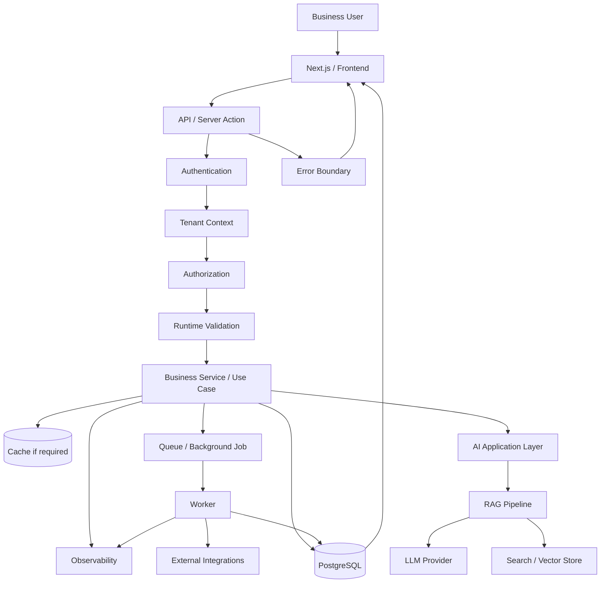
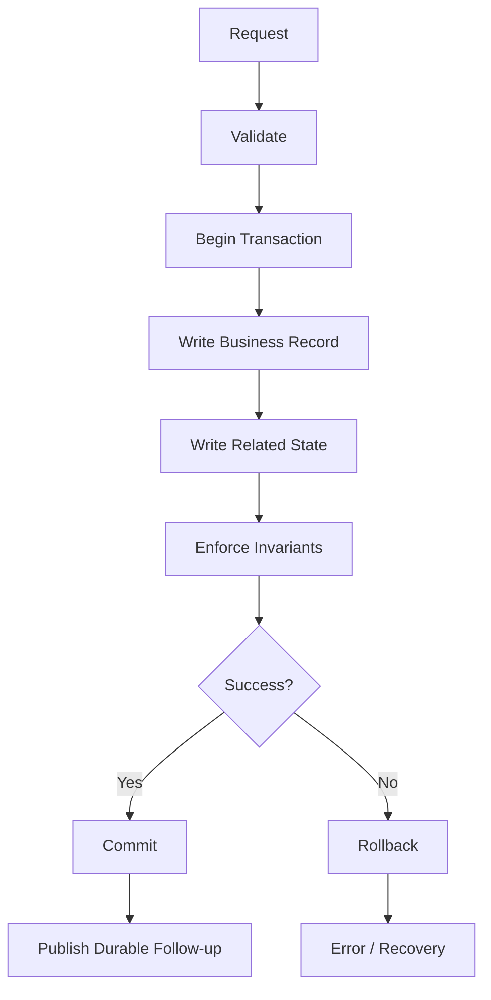
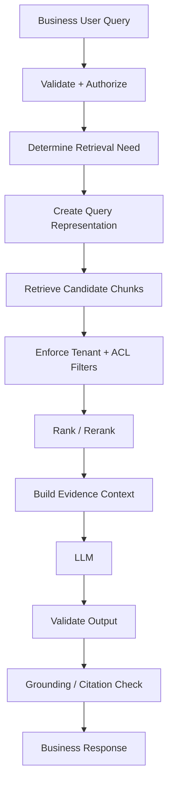
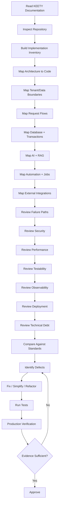

# Implementation.md — KEETY Production Implementation Standard & Brutal Review Framework

> **Status:** Canonical implementation standard for KEETY  
> **Purpose:** Define how KEETY code is to be implemented, reviewed, tested, operated, changed, and approved.  
> **Scope:** Frontend, backend, APIs, database, transactions, authentication, authorization, AI, RAG, automation, queues, integrations, observability, deployment, and production operations.

---

# 1. What This Document Is

This is **not** a generic coding-style guide.

It is the implementation contract for KEETY.

KEETY is a multi-tenant AI business assistant. A business may provide its business profile, products/services, documents, operational information, and other business data. KEETY uses that information to provide insights, recommendations, search/RAG answers, and potentially automation.

That means implementation quality is not only:

```text
Does the page render?
Does the API return 200?
Does the AI answer?
```

It is:

```text
Correctness
+
Tenant isolation
+
Business-rule correctness
+
Security
+
Data integrity
+
AI safety
+
RAG grounding
+
Automation reliability
+
Testability
+
Observability
+
Performance
+
Recoverability
+
Maintainability
```

The implementation must be designed so that another competent engineer can:

- understand it
- test it
- debug it
- modify it
- deploy it
- roll it back
- operate it
- explain why it works

without relying on undocumented tribal knowledge.

---

# 2. Brutal Implementation Principle

Do not confuse:

> **"The code works."**

with:

> **"The implementation is production-quality."**

A working demo can still have:

- broken authorization
- cross-tenant leakage
- race conditions
- weak validation
- unbounded AI cost
- ungrounded RAG answers
- duplicate automation
- transaction bugs
- unobservable failures
- impossible rollbacks
- excessive coupling
- dead code
- fake abstractions
- dependency sprawl

The implementation must be judged by behavior under:

```text
Normal operation
+
Invalid input
+
Failure
+
Concurrency
+
Scale
+
Security attacks
+
Dependency failure
+
Deployment changes
+
AI uncertainty
+
Data growth
```

---

# 3. Source-of-Truth Rule

Before changing implementation, compare:

```text
Product requirements
        ↓
Architecture
        ↓
Database
        ↓
Security
        ↓
Transactions
        ↓
AI
        ↓
RAG
        ↓
Automation
        ↓
Testing
        ↓
Implementation
        ↓
Runtime behavior
```

If documentation says one thing and code does another:

**Do not pretend they are equivalent.**

Record:

1. What the documentation says.
2. What the code does.
3. Why the mismatch exists.
4. Which behavior is intended.
5. What must change.
6. Which document becomes the source of truth.

The final implementation must describe the **real approved system**, not an imaginary architecture.

---

# 4. KEETY Implementation Priorities

When engineering trade-offs exist, prioritize:

1. Data safety
2. Tenant isolation
3. Authentication and authorization
4. Business correctness
5. Transactional integrity
6. AI/RAG correctness and safety
7. Automation reliability
8. Observability
9. Testability
10. Performance
11. Maintainability
12. Developer convenience

Do not sacrifice security or correctness merely to make implementation faster.

---

# 5. Implementation Inventory

Before reviewing or restructuring the repository, inventory:

- Frontend
- Pages/routes
- Components
- Server Components
- Client Components
- Server Actions
- API route handlers
- Middleware/proxy
- Authentication
- Authorization
- Validation
- Domain/business logic
- Services/use cases
- Data-access layer
- Database models
- Migrations
- Transactions
- Cache
- Search
- Object/file storage
- AI provider integrations
- Embedding provider
- RAG pipeline
- Vector storage
- Document ingestion
- Queues
- Workers
- Schedulers
- n8n/external automation
- External APIs
- Webhooks
- Email/notification integrations
- Logging
- Metrics
- Tracing
- Feature flags
- Configuration
- Tests
- CI/CD
- Containers
- Deployment
- Health checks
- Recovery mechanisms

Create an inventory:

| Layer | Component | Responsibility | Runtime | Depends On | Criticality |
|---|---|---|---|---|---|
| Frontend | ... | ... | Browser/Server | ... | ... |
| API | ... | ... | Server | ... | ... |
| Domain | ... | ... | Server | ... | ... |
| Data | ... | ... | Server | ... | ... |
| AI | ... | ... | Server/Worker | ... | ... |
| Automation | ... | ... | Worker/External | ... | ... |

If a component has no clear responsibility, investigate whether it should exist.

---

# 6. Architecture-to-Code Mapping

Every major architectural component must map to actual implementation.

Example:

```text
Architecture
    ↓
Tenant-aware API
    ↓
Actual route handler
    ↓
Actual service
    ↓
Actual authorization check
    ↓
Actual database query
```

Do not accept:

```text
architecture.md says it exists
```

as evidence that it actually exists.

Likewise, do not allow undocumented infrastructure to become accidental architecture.

---

# 7. Master KEETY Runtime Flow

Customize the following diagram to the actual implementation:



**Important:** Remove nodes that do not exist.

Never create architecture theater.

---

# 8. Request Lifecycle

Every critical request should follow an intentional lifecycle:

```text
Request
 ↓
Request ID / Trace Context
 ↓
Authentication
 ↓
Tenant Resolution
 ↓
Authorization
 ↓
Runtime Validation
 ↓
Business Use Case
 ↓
Transaction if required
 ↓
Database / External Dependency
 ↓
Domain Result
 ↓
Response Mapping
 ↓
Observability
```

Client validation may improve UX.

It is never the security boundary.

---

# 9. Tenant Resolution Is a Security Boundary

KEETY is multi-tenant.

Every request that accesses business data must establish:

```text
Authenticated User
        ↓
Tenant / Organization
        ↓
Resource
        ↓
Requested Action
```

Do not trust:

```text
tenantId from request body
```

by itself.

The server must determine whether the authenticated identity is actually allowed to operate within that tenant.

---

# 10. Tenant Context Propagation

Tenant identity must survive asynchronous boundaries.

Example:

```text
HTTP Request
 ↓
tenant_id
 ↓
Business Operation
 ↓
Job Payload
 ↓
Queue
 ↓
Worker
 ↓
Database
 ↓
RAG
 ↓
AI
 ↓
External Integration
```

Never rely on mutable global variables for tenant context.

Every asynchronous operation must carry enough validated context to identify:

- tenant
- actor/user where required
- resource
- operation
- correlation/request ID where appropriate

---

# 11. Cross-Tenant Isolation

Every data-access path must be reviewed for:

- Database queries
- Cache keys
- Search queries
- Vector retrieval
- Object storage
- Queues
- Logs
- Metrics
- Exports
- Analytics
- Webhooks
- Background jobs
- AI context

A query such as:

```sql
SELECT * FROM products WHERE id = $1;
```

is insufficient if product IDs are not globally authorized.

Prefer authorization-aware access patterns that enforce tenant ownership.

---

# 12. Frontend Implementation

Frontend responsibilities include:

- Presentation
- User interaction
- UX validation
- Loading states
- Error states
- Accessibility
- Data presentation
- Safe client-side state

Frontend must not own authoritative:

- Authorization
- Business permissions
- Tenant isolation
- Financial/business invariants
- Secret management
- Database decisions

---

# 13. Next.js Server/Client Boundary

For every component determine whether it should be:

- Server Component
- Client Component
- Server Action
- Route Handler
- Middleware/proxy

Ask:

> Why does this need to execute in the browser?

Client code must never receive:

- database credentials
- provider secrets
- private API keys
- internal service credentials
- server-only environment values

Review generated client bundles where sensitive boundaries matter.

---

# 14. React Component Responsibilities

A component should not casually contain:

```text
UI
+
API calls
+
database logic
+
business rules
+
AI prompts
+
analytics
+
authorization
```

Prefer clear boundaries.

But do not over-split a simple feature into dozens of meaningless files.

Avoid both:

> God components

and:

> Component explosion.

---

# 15. Business Logic Placement

Business rules must have an intentional home.

Do not scatter business logic across:

- React components
- API routes
- SQL strings
- utility files
- n8n workflows
- prompts
- UI conditionals

Example:

```text
API
 ↓
Use Case / Service
 ↓
Domain Rules
 ↓
Repository / Data Access
```

The exact architecture can vary, but responsibility must remain clear.

---

# 16. API Contract

Every important API endpoint should have an explicit contract:

```text
Method
Path
Authentication
Tenant requirement
Authorization
Input schema
Validation
Business operation
Side effects
Transaction boundary
Idempotency
Response schema
Error schema
Rate limit
Observability
```

Do not treat:

```text
HTTP 200
```

as sufficient testing or documentation.

---

# 17. Runtime Validation

TypeScript does not validate runtime input.

Use:

```text
Unknown Input
 ↓
Runtime Schema Validation
 ↓
Trusted Typed Data
 ↓
Business Logic
```

Validate:

- request body
- query parameters
- route parameters
- headers where relevant
- webhook payloads
- external API responses
- AI structured output
- job payloads

---

# 18. Type Safety

Avoid unnecessary:

```ts
any
```

Avoid unsafe casts used to silence errors.

Review:

- `any`
- `unknown`
- type assertions
- non-null assertions
- ignored TypeScript errors
- generated types
- duplicated DTOs
- API/domain mismatch

Type safety should make invalid states harder to represent.

---

# 19. External Data Is Untrusted

Treat responses from:

- AI providers
- payment providers
- email providers
- search APIs
- storage systems
- webhooks
- third-party SaaS
- user uploads

as untrusted input.

Use:

```text
External Response
 ↓
Schema Validation
 ↓
Normalization
 ↓
Business Rules
 ↓
Trusted Internal Representation
```

---

# 20. Authentication

Review:

- Login
- Logout
- Sessions
- Token expiration
- Refresh
- Password handling
- Recovery
- OAuth if used
- Cookie configuration
- Session invalidation
- Brute-force/rate limits

Authentication should fail closed.

---

# 21. Authorization

For every protected operation verify:

```text
Identity
+
Tenant
+
Resource
+
Action
+
Permission
```

Never treat:

```text
button hidden in frontend
```

as authorization.

Test both:

- horizontal access
- vertical privilege escalation

---

# 22. Database Implementation

Review:

- Schema
- Constraints
- Foreign keys
- Unique constraints
- Check constraints
- Indexes
- Relations
- Queries
- Migrations
- Connection pooling
- Transactions
- Locking
- Isolation

Application validation is useful.

Database constraints remain important protection against invalid state.

---

# 23. Database Query Discipline

Look for:

- N+1 queries
- Unbounded queries
- Missing pagination
- Missing indexes
- Repeated queries
- Large result sets
- Unnecessary joins
- Accidental full scans
- Query-per-row loops

Do not optimize from intuition alone.

Use query plans and measurements where practical.

---

# 24. N+1 Example

Danger:

```text
Load 100 products
 ↓
Query business data 100 times
```

Prefer appropriate:

- joins
- batching
- eager loading
- prefetching
- carefully designed data-access methods

Do not solve every query problem with caching.

---

# 25. Transaction Boundaries

A transaction should correspond to a meaningful consistency boundary.

Example:



Do not wrap the entire request in a transaction merely because transactions exist.

---

# 26. External Side Effects and Transactions

Never assume this is atomic:

```text
Database
+
Email
+
External API
```

A database transaction cannot automatically roll back an external provider.

Where appropriate:

```text
Database Transaction
 ↓
Commit
 ↓
Outbox / Queue
 ↓
External Side Effect
```

Use compensation or reconciliation where required.

---

# 27. Concurrency

Identify operations that can race:

- Product updates
- Inventory
- Orders
- Business settings
- AI job status
- Document processing
- Automation state
- Usage counters
- Subscription state
- Scheduled jobs

Use the appropriate combination of:

- database constraints
- transactions
- row locks
- optimistic concurrency
- atomic updates
- idempotency keys

---

# 28. Idempotency

For operations that may be retried, define whether they are idempotent.

Example:

```text
POST request
 ↓
Network timeout
 ↓
Client retries
```

The implementation must not accidentally create two business records.

Idempotency is especially important for:

- webhooks
- queue jobs
- automation
- external API calls
- AI-triggered actions
- document ingestion

---

# 29. Caching

Every cache must answer:

```text
What is cached?
Why?
Who owns the cache?
TTL?
Invalidation?
Tenant key?
Stale behavior?
Failure behavior?
```

Never create a cache key such as:

```text
products:123
```

if `123` can mean different data in different tenants.

Prefer explicit tenant-aware keys where required.

---

# 30. Cache Correctness

Caching is an optimization, not automatically a source of truth.

Ask:

> What happens when cached data is stale?

> What happens when invalidation fails?

> What happens when Redis is unavailable?

The application should degrade safely where practical.

---

# 31. AI Architecture

KEETY's AI implementation should look conceptually like:

```text
User Request
 ↓
Authentication
 ↓
Tenant Authorization
 ↓
Input Validation
 ↓
Intent / Task Classification
 ↓
Relevant Business Context
 ↓
RAG Retrieval if needed
 ↓
Prompt / Context Construction
 ↓
LLM
 ↓
Structured Output
 ↓
Schema Validation
 ↓
Grounding / Policy Validation
 ↓
Business Logic
 ↓
Response
```

AI must not become an uncontrolled replacement for deterministic business logic.

---

# 32. AI Output Is Untrusted

Never directly execute arbitrary AI output.

Dangerous pattern:

```text
LLM
 ↓
Tool call
 ↓
Database mutation
```

without validation.

Prefer:

```text
LLM
 ↓
Structured proposal
 ↓
Schema validation
 ↓
Authorization
 ↓
Business-rule validation
 ↓
Explicit execution
```

---

# 33. KEETY AI Business Context

KEETY should distinguish between:

```text
Known business facts
Derived analytics
Retrieved documents
AI-generated interpretation
AI recommendation
User-provided information
External information
```

Do not silently present generated recommendations as authoritative facts.

---

# 34. AI Failure Modes

Implementation must handle:

- timeout
- rate limit
- provider outage
- malformed response
- invalid structured output
- hallucination
- empty retrieval
- insufficient context
- context overflow
- model unavailable
- model changed
- token/cost limit
- safety refusal

Failure must be explicit and observable.

---

# 35. AI Cost Control

AI calls must have controls for:

- maximum input size
- maximum output size
- model selection
- retry count
- timeout
- per-request budget
- per-tenant usage
- expensive operation limits

Never allow an error loop to create unlimited AI calls.

---

# 36. RAG Implementation

KEETY RAG should conceptually follow:



Tenant filtering must not be an optional post-processing step if the underlying retrieval can expose unauthorized data.

---

# 37. RAG Ingestion

Document ingestion should be explicit:

```text
Upload
 ↓
Authentication
 ↓
Tenant authorization
 ↓
File validation
 ↓
Malware/security checks where applicable
 ↓
Storage
 ↓
Parsing
 ↓
Text extraction
 ↓
Normalization
 ↓
Chunking
 ↓
Metadata
 ↓
Embedding
 ↓
Vector/index storage
 ↓
Ready
```

Each stage needs failure and retry behavior.

---

# 38. RAG Metadata

Every retrievable chunk should have enough metadata to enforce:

- tenant
- document
- ownership
- permissions
- source
- version
- ingestion status
- timestamps

Do not treat the vector database as the authoritative ownership system.

---

# 39. RAG Retrieval Security

Retrieval must never become:

```text
semantic search across all businesses
```

without tenant/ACL filtering.

The correct mental model is:

```text
Allowed Documents
 ↓
Retrieval
 ↓
Relevant Chunks
```

not:

```text
All Documents
 ↓
Retrieval
 ↓
Hope unauthorized results are removed
```

---

# 40. Automation Implementation

Every KEETY automation should have:

```text
Trigger
 ↓
Validation
 ↓
Authorization
 ↓
Idempotency
 ↓
Queue / Workflow
 ↓
Worker / Execution
 ↓
External Dependency
 ↓
Database State
 ↓
Completion
```

Define:

- owner
- trigger
- inputs
- outputs
- timeout
- retry policy
- duplicate behavior
- recovery
- dead-letter behavior
- observability

---

# 41. Queue and Worker Implementation

For every job define:

```text
Job type
Payload schema
Tenant context
Actor context if needed
Idempotency key
Attempts
Timeout
Retryable errors
Permanent errors
Dead-letter behavior
Result
```

Workers must validate job payloads.

Do not assume the producer is always correct.

---

# 42. Stale Jobs

A worker may process a job after the underlying business state has changed.

Check:

- record version
- state transition
- cancellation
- expiration
- ownership
- tenant
- job generation/version

Do not blindly execute stale work.

---

# 43. Workflow Versioning

If automation behavior changes:

```text
Workflow v1
Workflow v2
```

decide how existing in-flight jobs are handled.

Never assume all jobs immediately switch to the newest logic.

---

# 44. n8n / External Workflow Tools

If n8n is used, do not allow it to become a second undocumented application backend.

Keep authoritative business rules in KEETY application code/database where appropriate.

Use workflow tooling for orchestration when it genuinely improves the system.

Document:

```text
What n8n owns
What KEETY owns
What data crosses the boundary
Who authenticates the call
How retries work
How duplicates are handled
How failures are recovered
```

---

# 45. Webhooks

Every webhook implementation should validate:

- signature
- timestamp/replay controls where supported
- payload schema
- event type
- tenant mapping
- event ID

Then apply idempotency.

Never trust a webhook merely because it came from an expected URL.

---

# 46. External Integration Boundary

Do not scatter provider calls throughout business logic.

Prefer:

```text
Business Use Case
 ↓
Integration Interface
 ↓
Provider Adapter
 ↓
External API
```

when the integration complexity justifies it.

This improves:

- testing
- provider replacement
- timeout handling
- error mapping
- observability

---

# 47. External API Failure

Every important integration needs explicit behavior for:

```text
Success
Timeout
429
4xx
5xx
Malformed response
Authentication failure
Provider outage
Provider schema change
```

Do not retry every error.

---

# 48. Retry Amplification

Be careful when multiple layers retry:

```text
Application retry
+
SDK retry
+
Queue retry
+
Provider retry
```

This can multiply traffic and cost.

Define where retries are owned.

Use:

- exponential backoff
- jitter
- bounded attempts
- total retry budget

where appropriate.

---

# 49. Error Handling

Errors must be classified.

At minimum distinguish:

```text
Validation
Authentication
Authorization
Not Found
Conflict
Rate Limit
Dependency
Transient
Permanent
Unexpected
```

Do not expose internal stack traces to users.

Do not silently swallow exceptions.

---

# 50. Error Response Contract

Use consistent error structures where appropriate:

```json
{
  "error": {
    "code": "RESOURCE_NOT_FOUND",
    "message": "Resource not found",
    "requestId": "..."
  }
}
```

Do not expose:

- SQL
- secrets
- internal file paths
- provider credentials
- sensitive prompts
- private tenant data

---

# 51. Observability

Critical operations should emit enough telemetry to answer:

```text
Who?
Tenant?
What?
When?
Request/job ID?
Which service?
Which dependency?
Duration?
Outcome?
Failure reason?
```

But telemetry must not become a data-leak channel.

---

# 52. Correlation IDs

Use a consistent correlation strategy across:

```text
Request
 ↓
Service
 ↓
Database interaction
 ↓
Queue
 ↓
Worker
 ↓
External API
```

Where appropriate propagate a safe correlation ID.

Do not use sensitive data as correlation identifiers.

---

# 53. Logging

Log useful events, not everything.

Avoid logging:

- passwords
- API keys
- tokens
- secrets
- full authentication headers
- unnecessary business documents
- sensitive user content
- complete AI prompts when sensitive

Use structured logs.

---

# 54. Metrics

Critical metrics may include:

- request count
- error count
- latency
- database latency
- queue depth
- job failure rate
- retry count
- AI request count
- AI latency
- AI token usage
- RAG retrieval latency
- document ingestion failures
- external API failures

Metrics should support operational decisions.

---

# 55. Tracing

Use tracing where it materially helps identify latency or distributed failures.

Useful spans:

```text
API
 ↓
DB
 ↓
RAG
 ↓
LLM
 ↓
Queue
 ↓
Worker
 ↓
External API
```

Never include sensitive payloads merely for tracing convenience.

---

# 56. Performance

Review:

- frontend bundle
- server rendering
- API latency
- database latency
- serialization
- cache performance
- queue latency
- AI latency
- RAG latency
- external APIs

Do not optimize imaginary bottlenecks.

Measure first.

---

# 57. Scalability

Ask what happens at:

```text
10x users
10x data
10x documents
10x AI requests
10x jobs
```

Then:

```text
100x
```

Find bottlenecks in:

- CPU
- memory
- database
- connections
- queue
- storage
- vector search
- AI provider limits
- external API quotas

Do not prematurely introduce microservices.

---

# 58. Cost-Aware Implementation

For expensive operations estimate:

```text
Frequency
×
Unit cost
×
Users
×
Retries
```

Especially:

- LLM calls
- embeddings
- document processing
- storage
- external APIs
- background jobs

A technically correct implementation can still be operationally unacceptable if cost grows uncontrollably.

---

# 59. Dependency Usage

Every important dependency should have a reason.

Review:

- duplicate libraries
- unused packages
- abandoned packages
- unnecessary wrappers
- client-only packages leaking server-side
- server-only packages leaking client-side

See `Dependency.md` for the complete dependency standard.

---

# 60. Abstraction Discipline

Do not create abstractions for appearance.

Bad:

```text
RepositoryFactory
RepositoryManager
RepositoryProvider
RepositoryAdapter
RepositoryResolver
```

for a simple operation with no meaningful variation.

Use abstraction when it reduces real:

- coupling
- complexity
- testing difficulty
- replacement cost
- repeated behavior

---

# 61. DRY Discipline

Do not eliminate every repeated line.

Sometimes:

```text
small duplication
```

is safer than:

```text
large shared abstraction
```

Ask:

> Does this abstraction reduce total system complexity?

If not, do not add it.

---

# 62. Code Complexity

Review:

- deeply nested conditions
- giant functions
- giant files
- excessive inheritance
- hidden side effects
- unclear state machines
- implicit global state
- complex generic types
- overuse of callbacks

Prefer code that is easy to reason about.

---

# 63. Function Size

A function should have a comprehensible purpose.

If a function is hundreds of lines long, investigate.

But do not split one obvious five-line operation into ten meaningless functions.

---

# 64. File Organization

Organize by meaningful responsibility/domain.

A possible structure:

```text
src/
├── app/
├── components/
├── features/
├── api/
├── domain/
├── services/
├── db/
├── auth/
├── ai/
├── rag/
├── jobs/
├── integrations/
├── lib/
├── observability/
└── tests/
```

This is a guide, not a mandatory directory tree.

The actual repository should use the simplest structure that preserves boundaries.

---

# 65. Dependency Direction

Prefer a clear direction such as:

```text
Presentation
 ↓
Application / Use Cases
 ↓
Domain
 ↓
Infrastructure
```

Avoid arbitrary cycles.

Infrastructure should not silently dictate business rules.

---

# 66. Circular Dependencies

Look for:

```text
A → B
B → C
C → A
```

Circular dependencies make:

- testing harder
- initialization fragile
- refactoring harder
- ownership unclear

Remove them where practical.

---

# 67. State Ownership

Every important state must have an owner.

Examples:

```text
Business truth → Database
Session → Auth/session system
Job execution → Queue/workflow state
Document status → Database
Retrieved context → Request-scoped computation
AI answer → Generated output, not business truth
```

Avoid multiple competing sources of truth.

---

# 68. Data Lifecycle

For every important data type document:

```text
Created
 ↓
Validated
 ↓
Transformed
 ↓
Stored
 ↓
Read
 ↓
Updated
 ↓
Indexed
 ↓
Cached
 ↓
Deleted
```

This is especially important for:

- customer data
- business documents
- product information
- AI context
- logs
- exports

---

# 69. Sensitive Data Lifecycle

Identify where sensitive data appears:

```text
Browser
API
Database
Cache
Queue
Logs
AI provider
Vector store
Object storage
Backups
```

Each location requires an intentional security decision.

---

# 70. File Upload Implementation

For uploaded business documents:

```text
Upload
 ↓
Authenticate
 ↓
Authorize tenant
 ↓
Validate size
 ↓
Validate MIME/type
 ↓
Secure filename handling
 ↓
Store safely
 ↓
Process asynchronously
```

Do not trust file extensions alone.

Document-processing dependencies are security-sensitive.

---

# 71. Document Processing

Treat parsers as untrusted-input processors.

Handle:

- malformed documents
- huge documents
- compressed archives
- parser failures
- resource exhaustion
- unexpected MIME types
- malicious content
- timeouts

Use resource limits.

---

# 72. Database Migrations

Every migration must consider:

- new database
- existing production data
- indexes
- locks
- runtime compatibility
- rollback strategy
- long-running migrations
- concurrent traffic

Prefer backward-compatible migration patterns for rolling deployments.

---

# 73. Expand-and-Contract Migration

For breaking schema changes prefer:

```text
Expand
 ↓
Deploy compatible application
 ↓
Backfill
 ↓
Switch reads/writes
 ↓
Remove old schema
```

Do not assume application deployment and schema replacement happen instantaneously.

---

# 74. Backward Compatibility

During rolling deployment consider:

```text
Old application
+
New application
+
Old data
+
New data
```

For:

- APIs
- database schemas
- queue payloads
- job formats
- webhooks
- external integrations

---

# 75. Queue Compatibility During Deployment

If worker code changes:

```text
Old jobs
+
New worker
```

must be considered.

If producer and consumer versions can overlap, job payloads should remain compatible or be explicitly versioned.

---

# 76. Feature Flags

Feature flags must have:

- owner
- purpose
- default
- rollout plan
- expiration/removal plan

Test:

- enabled
- disabled
- partial rollout where applicable

Do not accumulate permanent flags.

---

# 77. Configuration

Separate:

```text
Code
```

from:

```text
Environment-specific configuration
```

Examples:

- database URL
- provider URL
- model name
- timeout
- feature flag
- environment name

Secrets belong in secret management, not source code.

---

# 78. Environment Safety

Verify:

```text
Development ≠ Production
Staging ≠ Production
```

Prevent:

- local code accidentally mutating production
- staging sending real user communications
- test jobs entering production queues
- development using production secrets

---

# 79. Testing Alignment

Every important implementation path must map to testing.

Example:

```text
Authorization implementation
 ↓
Unauthorized access test

Transaction implementation
 ↓
Rollback test

RAG implementation
 ↓
Retrieval + grounding tests

Automation implementation
 ↓
Retry + duplicate + recovery tests
```

See `testing.md` for the full testing standard.

---

# 80. Testability

Ask:

> Can this module be tested without starting the entire system?

Avoid excessive:

- global state
- hardcoded dependencies
- hidden network calls
- hidden database access
- time-dependent behavior
- randomness without control

Use dependency injection where it materially improves testing.

Do not build a giant DI framework for a small application.

---

# 81. Production Bug Feedback Loop

Every important production bug should become:

```text
Production defect
 ↓
Reproduction
 ↓
Root cause
 ↓
Fix
 ↓
Regression test
 ↓
Monitoring improvement if needed
 ↓
Documentation improvement if needed
```

Do not merely patch the symptom.

---

# 82. AI-Generated Code Audit

Assume parts of KEETY may be written or assisted by AI.

Be especially suspicious of:

- duplicated abstractions
- invented APIs
- incorrect SDK usage
- unsafe defaults
- swallowed errors
- excessive try/catch
- unnecessary dependencies
- fake optimizations
- inconsistent patterns
- security assumptions
- unbounded retries
- incorrect async handling
- dead code

"The AI generated it" is not a technical justification.

---

# 83. AI Prompt Implementation

Prompts are application logic.

Version and review important prompts.

Document:

- purpose
- expected input
- context
- output schema
- failure behavior
- safety constraints
- model
- evaluation coverage

Do not bury critical business rules exclusively inside prompts.

---

# 84. AI Tool Execution

If KEETY eventually allows AI to call tools:

```text
AI proposes action
 ↓
Validate tool name
 ↓
Validate arguments
 ↓
Validate tenant
 ↓
Validate authorization
 ↓
Validate business rules
 ↓
Apply idempotency
 ↓
Execute
 ↓
Record result
```

AI must never bypass normal authorization.

---

# 85. AI Side Effects

Classify AI operations:

### Read-only

Examples:

- explain product data
- summarize documents
- analyze metrics

### Mutating

Examples:

- create record
- modify product
- send message
- trigger automation

Mutating actions require stronger validation and authorization.

---

# 86. RAG Grounding

For important answers, the implementation should preserve enough evidence to determine:

```text
What was retrieved?
Why was it retrieved?
Which tenant?
Which document/version?
What did the model receive?
What did the model produce?
```

Do not claim an answer is grounded merely because a vector search occurred.

---

# 87. RAG Empty Retrieval

If retrieval finds no relevant evidence, define behavior.

Possible behavior:

```text
No evidence
 ↓
Do not invent business facts
 ↓
Tell user evidence is insufficient
 ↓
Optionally ask for clarification
```

Do not automatically fill missing business facts from model memory.

---

# 88. RAG Access Control

Authorization must apply before retrieved content reaches the model.

The model must never receive unauthorized tenant content even if the final answer is expected to omit it.

---

# 89. Automation Recovery

For every important automation define:

```text
Success
Retryable failure
Permanent failure
Duplicate
Timeout
Cancellation
Partial completion
Recovery
Dead-letter
Manual intervention
```

A workflow that works once is not production automation.

---

# 90. Graceful Shutdown

Workers and services must handle shutdown intentionally.

Consider:

- in-flight requests
- active jobs
- database connections
- queue acknowledgements
- external calls

Avoid abruptly terminating work in a way that creates duplicate or corrupted processing.

---

# 91. Resource Limits

Bound:

- request body size
- file size
- query size
- AI context
- AI output
- database result size
- queue payload
- job runtime
- external request time
- concurrency

Unbounded input is an operational risk.

---

# 92. Rate Limiting

Apply rate limits where expensive or abuse-prone operations exist.

Especially:

- authentication
- AI requests
- document ingestion
- search
- expensive reports
- automation triggers
- public webhooks

Rate limits should be tenant/user aware where appropriate.

---

# 93. Performance Budgets

Define budgets for critical paths where useful:

```text
Frontend initial load
API p95 latency
Database query latency
AI latency
RAG latency
Job processing time
```

Do not choose arbitrary numbers just to have a number.

Use actual product requirements and observed behavior.

---

# 94. Memory and Connection Management

Review for:

- connection leaks
- event listeners not removed
- timers not cleared
- unbounded arrays/maps
- oversized caches
- database pool exhaustion
- worker memory growth

Long-running workers require particular attention.

---

# 95. Async Correctness

Look for:

- missing `await`
- unhandled promises
- fire-and-forget operations
- race conditions
- incorrect transaction boundaries
- parallel calls that should be sequential
- sequential calls that can safely be parallel

Every asynchronous operation needs an intentional failure strategy.

---

# 96. Fire-and-Forget Rule

Never casually do:

```ts
someImportantOperation();
return success;
```

if the operation affects correctness.

Either:

- await it
- enqueue it durably
- record its state
- or explicitly classify it as non-critical telemetry

---

# 97. API Pagination

Any potentially large collection must have a bounded retrieval strategy.

Review:

- page size
- maximum page size
- ordering
- cursor stability
- filters
- pagination consistency

Do not allow:

```text
GET all products
```

to become an accidental production outage.

---

# 98. Search and Filtering

Search implementation must define:

- tenant filtering
- authorization filtering
- normalization
- pagination
- sorting
- limits
- special characters
- empty queries
- expensive query protection

---

# 99. Observability vs Privacy

Do not solve debugging by logging everything.

The correct target is:

> **Enough telemetry to diagnose the system without unnecessarily collecting sensitive business data.**

---

# 100. Deployment Implementation

A typical controlled path is:

```text
Git change
 ↓
CI
 ↓
Lint / Typecheck
 ↓
Unit tests
 ↓
Integration tests
 ↓
Security checks
 ↓
Build
 ↓
Artifact
 ↓
Deploy
 ↓
Migration strategy
 ↓
Health checks
 ↓
Smoke tests
 ↓
Monitoring
 ↓
Rollback if required
```

Customize this to the actual infrastructure.

---

# 101. Deployment Verification

After deployment verify:

- application starts
- database connectivity
- authentication
- critical API
- critical business flow
- AI path
- RAG path if relevant
- worker health
- queue processing
- external integrations

Do not stop at:

```text
Container is running.
```

---

# 102. Rollback

A rollback plan must consider:

- application version
- database schema
- migrations
- queue payloads
- worker versions
- feature flags
- external API compatibility
- in-flight jobs
- generated artifacts

"Deploy the previous image" is not automatically a safe rollback.

---

# 103. Health Checks

Health checks should distinguish:

### Liveness

Is the process alive?

### Readiness

Can it safely receive work?

Do not make liveness depend on every external dependency unless that is intentionally required.

---

# 104. Graceful Dependency Failure

A provider outage should not necessarily make the entire application unavailable.

Where appropriate isolate:

```text
AI unavailable
```

from:

```text
Core business data unavailable
```

and vice versa.

Fail with clear behavior.

---

# 105. Technical Debt

Track:

- TODOs
- temporary workarounds
- deprecated APIs
- duplicated code
- weak tests
- missing observability
- abandoned flags
- migration debt
- dependency debt

Technical debt should have:

```text
Problem
Impact
Owner
Priority
Plan
```

---

# 106. Dead Code

Identify and remove:

- unused routes
- unused components
- obsolete services
- stale feature flags
- old adapters
- commented-out code
- unused dependencies

Do not preserve dead code out of fear.

Use version control for history.

---

# 107. Magic Values

Review hardcoded:

- URLs
- timeouts
- role names
- status names
- model names
- limits
- feature values

Centralize values when that improves consistency.

Do not create giant configuration files for values that genuinely belong in code.

---

# 108. Naming

Names should communicate intent.

Prefer:

```text
createBusinessProfile
retrieveAuthorizedDocuments
generateBusinessInsight
processDocumentIngestion
```

over vague:

```text
process
handle
data
result
temp
```

Good names reduce the need for comments.

---

# 109. Comments

Comments should explain:

- why
- constraints
- unusual decisions
- external limitations
- security reasoning

Do not comment obvious code.

Bad:

```ts
// increment counter
counter++;
```

Good:

```ts
// This counter is intentionally updated atomically because multiple
// workers may process the same tenant concurrently.
```

---

# 110. Code Ownership

Every critical module should have an owner or team.

Examples:

```text
Authentication → Auth owner
RAG → AI/data owner
Automation → Automation owner
Database → Backend/data owner
Deployment → Platform owner
```

Ownership should not become a single-person knowledge silo.

---

# 111. Bus Factor

Ask:

> If one developer disappears tomorrow, can another engineer safely operate KEETY?

Required knowledge should exist in:

- code
- tests
- documentation
- runbooks
- architecture records

not only in someone's memory.

---

# 112. Documentation Quality

Implementation documentation should explain:

- what exists
- why it exists
- how components connect
- how requests flow
- how data flows
- how failures flow
- how AI works
- how RAG works
- how automation works
- how deployment works
- how to debug it

Do not copy the entire source code into documentation.

---

# 113. Implementation Decision Record

For major architectural implementation decisions record:

```text
Decision
Problem
Chosen approach
Alternatives considered
Why chosen
Trade-offs
Security implications
Performance implications
Operational implications
Rollback/exit strategy
Owner
```

---

# 114. Review Against Other KEETY Standards

Implementation must be checked against:

```text
architecture.md
frontend.md
backend.md
database.md
transaction.md
security.md
dependency.md
ai.md
RAG.md
automation.md
testing.md
FindandFixbugAutomation.md
review.md
```

A strong implementation that violates a critical security or transaction requirement is still unacceptable.

---

# 115. Requirements Traceability

For every critical requirement:

```text
Requirement
 ↓
Architecture decision
 ↓
Implementation
 ↓
Automated test
 ↓
Observability
```

If a critical requirement has no implementation or test evidence, flag it.

---

# 116. Critical Business Invariants

Explicitly identify invariants.

Examples:

```text
A user cannot access another tenant's data.

A deleted business cannot continue receiving active automation.

A completed job cannot be processed as a new job accidentally.

A product cannot belong to two unrelated tenants.

AI cannot authorize an operation that the user is not authorized to perform.

RAG cannot retrieve unauthorized documents.

```

The actual invariant list must come from KEETY's business requirements.

---

# 117. Invariant Enforcement

Where possible enforce important invariants at multiple layers:

```text
API authorization
+
Business logic
+
Database constraint
```

Do not rely on one fragile check when a stronger boundary is available.

---

# 118. Failure Injection

Critical implementation paths should be reviewed under:

- database unavailable
- cache unavailable
- AI unavailable
- vector store unavailable
- queue unavailable
- external API timeout
- malformed response
- worker crash
- duplicate event
- concurrent request

The goal is not to make every component infinitely resilient.

The goal is predictable failure.

---

# 119. Production Debugging Test

Imagine a user reports:

> "KEETY gave me the wrong business answer."

Can engineering determine:

```text
User
 ↓
Tenant
 ↓
Request
 ↓
Retrieved documents
 ↓
RAG filters
 ↓
Prompt/context
 ↓
Model
 ↓
Validation
 ↓
Final response
```

without guessing?

If not, AI observability is incomplete.

---

# 120. Production Debugging — Automation

Imagine:

> "My automation ran twice."

Can engineering determine:

```text
Trigger
 ↓
Event ID
 ↓
Job ID
 ↓
Attempt count
 ↓
Worker
 ↓
External API
 ↓
Database state
```

If not, automation observability is incomplete.

---

# 121. Production Debugging — Data

Imagine:

> "My product disappeared."

Can engineering determine:

```text
Actor
 ↓
Request
 ↓
Authorization
 ↓
Mutation
 ↓
Transaction
 ↓
Database change
 ↓
Related automation
```

If not, data-change observability is incomplete.

---

# 122. Implementation Security Review

Check:

- authentication
- authorization
- tenant isolation
- input validation
- output encoding
- secrets
- cookies
- CSRF where applicable
- CORS
- rate limits
- file uploads
- SSRF
- injection
- deserialization
- command execution
- logs
- error responses

Then compare with `Security.md`.

---

# 123. Implementation Testing Review

Check:

- unit tests
- integration tests
- API tests
- authorization tests
- transaction tests
- concurrency tests
- AI evaluations
- RAG evaluations
- automation tests
- E2E
- performance tests
- security tests
- regression tests

Then compare with `Testing.md`.

---

# 124. Implementation Dependency Review

For each critical dependency:

```text
Why?
Where?
What permissions?
What data?
What happens if unavailable?
What happens if compromised?
How upgraded?
How rolled back?
```

Then compare with `Dependency.md`.

---

# 125. Implementation Transaction Review

For each critical multi-step operation:

```text
What must be atomic?
What may be eventually consistent?
What happens on failure?
What happens on retry?
What happens concurrently?
What happens after external side effects?
```

Then compare with `Transaction.md`.

---

# 126. Implementation Automation Review

For every job:

```text
Trigger
 ↓
Validation
 ↓
Authorization
 ↓
Idempotency
 ↓
Execution
 ↓
Retry
 ↓
Recovery
 ↓
Observability
```

Then compare with `Automation.md`.

---

# 127. Implementation AI Review

For every AI feature:

```text
Input
 ↓
Authorization
 ↓
Context
 ↓
Prompt
 ↓
Model
 ↓
Output validation
 ↓
Grounding
 ↓
Business rules
 ↓
Response
```

Then compare with `AI.md`.

---

# 128. Implementation RAG Review

For every RAG feature:

```text
Document
 ↓
Tenant ownership
 ↓
Parsing
 ↓
Chunking
 ↓
Embedding
 ↓
Index
 ↓
Authorized retrieval
 ↓
Context
 ↓
LLM
 ↓
Grounding
```

Then compare with `RAG.md`.

---

# 129. Implementation Review Workflow

Use this order:



---

# 130. Required Implementation Diagrams

The canonical implementation documentation should contain, where applicable:

1. Master architecture-to-code flow
2. Request lifecycle
3. Authentication flow
4. Authorization/tenant flow
5. Database flow
6. Transaction flow
7. AI flow
8. RAG ingestion flow
9. RAG retrieval flow
10. Automation flow
11. Queue/worker flow
12. Error flow
13. Deployment flow
14. Recovery flow

Only document components that actually exist.

---

# 131. Brutal Code Review Questions

## Architecture

1. Does code match architecture?
2. Are there imaginary components in documentation?
3. Are there undocumented components in code?
4. Is anything unnecessarily distributed?
5. Is anything unnecessarily abstracted?

## Backend

6. Are business rules in the correct layer?
7. Are API boundaries clean?
8. Is validation server-side?
9. Are errors consistent?
10. Are external integrations isolated?

## Database

11. Are queries bounded?
12. Are indexes justified?
13. Are transactions correct?
14. Are invariants enforced?
15. Are race conditions addressed?

## Security

16. Can auth be bypassed?
17. Can authorization be bypassed?
18. Can User A access Tenant B?
19. Can a normal user perform admin operations?
20. Can secrets reach the client?

## AI

21. Is model output validated?
22. Is AI allowed to cause side effects?
23. Are tool calls authorized?
24. Is cost bounded?
25. What happens when the provider fails?

## RAG

26. Are tenant filters applied before model context?
27. Can unauthorized chunks enter context?
28. Is source metadata preserved?
29. What happens with zero retrieval results?
30. Can engineers debug a wrong answer?

## Automation

31. Are jobs idempotent?
32. Are duplicates safe?
33. Are stale jobs handled?
34. Are retries bounded?
35. Can failed jobs recover?

## Performance

36. Where is the first 10x bottleneck?
37. Are there N+1 queries?
38. Are AI calls bounded?
39. Are queues bounded?
40. Are result sets bounded?

## Operations

41. Can production failures be traced?
42. Can deployments be verified?
43. Can critical deployments be rolled back?
44. Are migrations compatible?
45. Can another engineer operate the system?

---

# 132. What NOT To Do

Do not:

- add microservices because they look advanced
- add Redis without a real need
- add Kafka without a real workload
- add queues without asynchronous requirements
- add n8n because automation looks impressive
- add AI where deterministic code is safer
- create interfaces for every class
- create five abstractions around one database query
- duplicate business logic between frontend and backend
- trust frontend validation
- trust TypeScript types as runtime validation
- trust AI output
- trust external API responses blindly
- swallow errors
- use infinite retries
- log secrets
- put secrets in client code
- rely on hidden frontend buttons for authorization
- make RAG retrieve globally and filter afterward
- use global mutable tenant state
- treat cache as the source of truth without justification
- ignore stale jobs
- ignore duplicate webhooks
- make production depend on a developer laptop
- document imaginary architecture
- optimize without measurements
- keep dead code because "maybe we need it"
- accept AI-generated code without review

---

# 133. Implementation Quality Levels

### 0–2 — Dangerous

Critical security, data integrity, or reliability problems.

### 3–4 — Prototype

Works for demonstration but has major production gaps.

### 5–6 — Functional

Core implementation works but meaningful technical debt or risk remains.

### 7–8 — Strong

Clear boundaries, good testing, security, observability, and maintainability.

### 9 — Excellent

Production-grade implementation with strong failure handling and disciplined complexity.

### 10 — Exceptional

Rare.

Only use 10 when evidence demonstrates exceptional engineering discipline **without unnecessary complexity**.

A large codebase is not evidence of quality.

A high test count is not evidence of quality.

A sophisticated architecture is not evidence of quality.

---

# 134. Final Approval Gate

Do not approve the implementation merely because:

- the app starts
- the UI looks good
- APIs return 200
- database queries work
- AI responds
- n8n executes
- CI is green

Approve only when there is evidence that:

- every critical component has a clear responsibility
- tenant boundaries are explicit
- authorization is server-enforced
- critical data flows are understood
- transaction boundaries are justified
- external integrations are controlled
- AI output is validated
- RAG retrieval is authorized and traceable
- automation is idempotent and recoverable
- critical paths are tested
- production failures are observable
- dependencies have controlled boundaries
- deployments are verifiable
- rollback is understood
- migrations are compatible
- unnecessary complexity has been removed
- documentation matches reality

---

# 135. Final Principal Engineer Test

Pretend another engineering team inherits KEETY tomorrow.

They have:

- no private context
- no original developer
- production users
- a production incident at 2 AM

Can they:

```text
Understand the system?
        ↓
Find the failing component?
        ↓
Reproduce the issue?
        ↓
Identify root cause?
        ↓
Fix it safely?
        ↓
Write a regression test?
        ↓
Deploy it?
        ↓
Verify it?
        ↓
Rollback if required?
```

If not:

> **The implementation is not mature enough.**

---

# 136. Golden Implementation Rule

Every important implementation decision must answer:

> **Why does this exist?**

Then:

> **Why is it implemented this way?**

Then:

> **What happens when it fails?**

Then:

> **How do we test it?**

Then:

> **How do we observe it?**

Then:

> **How do we change it later?**

If those answers do not exist:

**The implementation is not finished.**

---

# 137. Final KEETY Principle

Do not optimize for:

> "The code runs."

Do not optimize for:

> "The architecture looks enterprise."

Do not optimize for:

> "There are many folders."

Do not optimize for:

> "We use modern technologies."

Do not optimize for:

> "AI generated the code quickly."

Optimize for:

> **Correctness + tenant isolation + simplicity + maintainability + security + testability + observability + performance + recoverability.**

The best KEETY implementation is not the one with the most technologies.

It is:

> **The simplest implementation that correctly solves KEETY's real business requirements while remaining secure, testable, observable, maintainable, and capable of evolving.**

---

# 138. Final Statement

`Implementation.md` is complete only when it describes and enforces the **real KEETY system**.

No:

- architecture theater
- abstraction theater
- AI-generated-code theater
- diagram theater
- technology-for-resume theater
- green-CI theater
- "works on my machine" engineering

Be evidence-driven.

Be technically precise.

Be willing to delete code.

Be willing to simplify architecture.

Be willing to reject unsafe implementation.

And always ask:

> **"If this system had 100x more users, 100x more data, hostile input, dependency failures, AI failures, duplicate events, concurrent requests, and a production incident at 2 AM — would I still trust this implementation?"**

If the answer is no:

**Fix it before calling it production-ready.**
